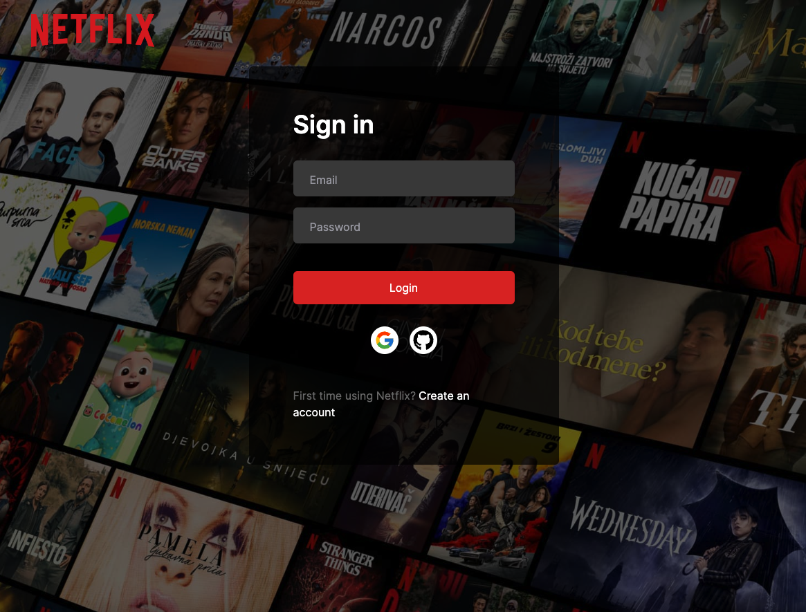

# Netflix Clone(Next.js, Prisma, MongoDB, NextAuth)

Google and GitHub social login in Nextjs using NextAuth



## Getting Started

First, run the development server:

```bash
yarn dev
```

Open [http://localhost:3000](http://localhost:3000) with your browser to see the result.

Package:
* Zustand: state-management solution.
* react-icons: pouplar icons.

## App Router

### Navigation

To use `useRouter`, import it from `next/navigation`, and call the hook inside your Client Component:

```javascript
import { useRouter } from 'next/navigation';
```

### NextAuth.js

Next.js 13.2 introduced Route Handlers, the preferred way to handle REST-like requests in App Router (`app/`).


```typescript
/**
PATH: /app/api/auth/[...nextauth]/route.ts
**/

import NextAuth from "next-auth"

const handler = NextAuth({
  ...
})

export { handler as GET, handler as POST }
```
